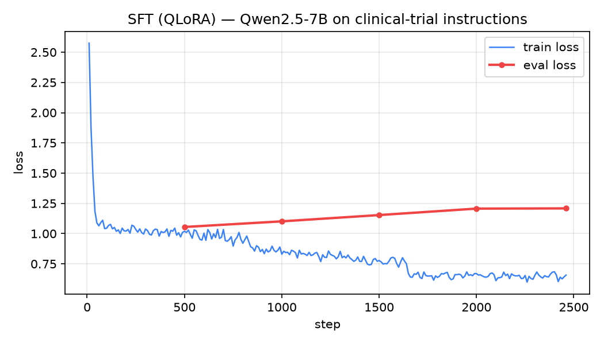
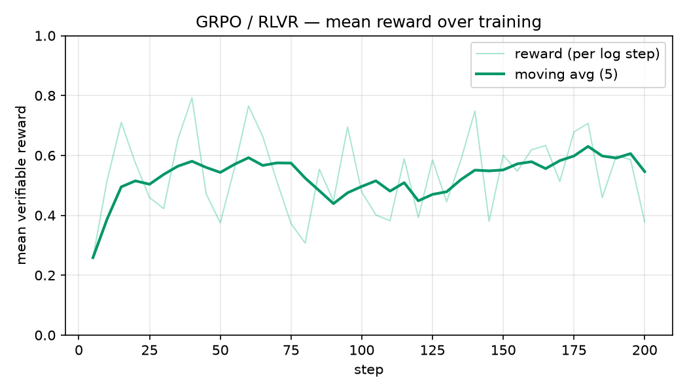
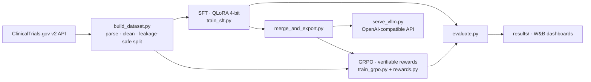

# ClinTrial-LM — Instruction Fine-Tuning + RLVR for Clinical Trials

Turns **Qwen2.5-7B-Instruct** into a specialist clinical-trial assistant, via a complete,
reproducible LLM pipeline run end-to-end on **a single H100**:

> **data curation → SFT (QLoRA) → GRPO / RL with Verifiable Rewards → evaluation → serving**

Four tasks: plain-language trial summaries, structured eligibility-criteria extraction,
condition Q&A, and phase classification.


> ⚕️ Research/education demo. Outputs are **not medical advice**.

---

## Headline results

Measured on a **held-out test set split by trial** (no trial appears in both train and test),
500 sampled examples. Numbers come straight from `results/metrics_*.json` via
`scripts/make_report.py` — never hand-typed.

| Task | Metric | Base Qwen2.5-7B | **SFT (QLoRA)** | GRPO (RLVR) |
|---|---|---|---|---|
| Phase classification | exact match | 0.000 | **0.794** | **0.804** |
| Condition Q&A | token F1 | 0.298 | **0.742** | **0.748** |
| Eligibility extraction | criterion F1 | 0.728 | **0.821** | 0.820 |
| Plain-language summary | ROUGE-L | 0.195 | **0.290** | 0.289 |
| Eligibility output | JSON validity | 0.843 | 0.843 | 0.843 |

**SFT delivered the step change** (phase classification went from *completely unusable* to 79%).
**GRPO matched it with a small edge on two tasks** — an honest result, discussed below.

### Why the base model scored 0.00 on phase classification
It isn't ignorant — it's **undisciplined**. It knows the answer but won't answer in the required format:

```
Reference : "This trial studies: Carpal Tunnel Syndrome."
Base      : "The medical condition studied in this trial is Carpal Tunnel Syndrome (CTS)."   ✗
SFT       : "This trial studies: Carpal Tunnel Syndrome."                                    ✓
```
On phase, the base model even **hallucinated** "Phase I/II" for a trial with no phase; the SFT model
correctly returned `Na`. Fine-tuning buys **format discipline and faithfulness**, not just knowledge.

---

## Training curves

| SFT (QLoRA) | GRPO (RLVR) |
|---|---|
|  |  |

### 🔍 The most interesting finding: the SFT run overfit — and the config caught it
Look at the left chart. **Train loss falls (2.57 → 0.65) while eval loss *rises* (1.05 → 1.21) after
step ~500.** That's textbook overfitting: past ~0.6 of one epoch the model began memorising.

Because the config sets `load_best_model_at_end: true` with `metric_for_best_model: eval_loss`,
the trainer **shipped the step-500 checkpoint, not the overfit final one** — which is why the
evaluation numbers above hold up. **3 epochs was too many for this dataset; ~1 epoch (or early
stopping) is the right setting.** Kept in the repo deliberately: a real curve with a real lesson.

---

## Pipeline



---

## The data (26,216 train / 1,464 val / 1,460 test)

Built from **8,000 real trials** on ClinicalTrials.gov. The key decision: **targets come from the
registry's own structured fields**, not from a teacher LLM — so labels are auditable and free of
another model's hallucinations.

**Raw registry text → cleaned training target:**
```
RAW: "Inclusion Criteria: 1. Age greater than or equal to 18 years 2. Ability to speak and read
      comfortably in English ... Exclusion Criteria: 1. Current incarceration 2. Individuals
      incapable of consenting ..."

TARGET: { "inclusion": ["Age greater than or equal to 18 years",
                        "Ability to speak and read comfortably in English", ...],
          "exclusion": ["Current incarceration",
                        "Individuals incapable of consenting ...", ...] }
```

Cleaning ([`data/build_dataset.py`](data/build_dataset.py)): whitespace normalisation, inclusion/exclusion
header parsing, bullet-marker stripping, fragment filtering, quality thresholds — and a
**leakage-safe split on trial ID (not on example)**, so a trial's four examples can never straddle
train and test (a subtle bug that silently inflates scores).

---

## GRPO with Verifiable Rewards (RLVR)

The interesting part. Instead of a learned reward model or human labels, every task here has a
**programmatic correctness check** — so the model can be rewarded automatically
([`src/rewards.py`](src/rewards.py)):

| Task | Reward |
|---|---|
| `extract_eligibility` | `0.5 × valid-JSON  +  0.5 × criterion F1` — **invalid JSON scores 0.0** |
| `phase_classification` | exact match |
| `condition_qa` | token F1 |
| `plain_language_summary` | ROUGE-L |

GRPO samples a **group of 8 answers per prompt**, scores each with this function, and pushes the
policy toward the above-average ones (group-relative advantage → no value network needed).
Mean reward climbed **0.26 → ~0.60**.

### Honest result: GRPO did not beat a strong SFT baseline
It gained +0.010 on phase and +0.006 on condition, and **did not move JSON validity (0.843)**. Why:
- **Short, conservative run** — 200 steps, LR `1e-6`, KL `beta=0.04`, which by design keeps the
  policy very close to the SFT reference.
- **The SFT baseline was already strong** (0.74–0.82); RL squeezing more out of an already-good
  policy is genuinely hard.
- **`frac_reward_zero_std ≈ 0.3`** — on ~30% of prompts all 8 samples scored *identically*, giving
  those steps **zero gradient signal**.

This is reported rather than buried. Knowing *why* an RL run was flat is more valuable than a
suspicious jump. Next levers: higher LR, lower KL, more steps, vLLM-backed generation for faster
iteration, and reward shaping focused on the tasks with real headroom.

---

## Skills demonstrated (mapped to job descriptions)

| JD language | Where |
|---|---|
| Dataset curation, instruction formatting | [`data/build_dataset.py`](data/build_dataset.py) |
| Leakage-safe evaluation splits | `split_by_trial()` |
| **PEFT — LoRA / QLoRA**, 4-bit NF4 quantization | [`src/train_sft.py`](src/train_sft.py), [`configs/`](configs/) |
| Memory-efficient training (bf16, grad checkpointing) | [`configs/qlora_sft.yaml`](configs/qlora_sft.yaml) |
| **RLHF-family alignment — GRPO / RLVR** | [`src/train_grpo.py`](src/train_grpo.py), [`src/rewards.py`](src/rewards.py) |
| Reward function design | [`src/rewards.py`](src/rewards.py) |
| HF ecosystem (Transformers / TRL / PEFT / Accelerate) | throughout |
| Model evaluation, LLM-as-judge | [`src/evaluate.py`](src/evaluate.py) |
| Experiment tracking (Weights & Biases) | [`scripts/log_to_wandb.py`](scripts/log_to_wandb.py) |
| Diagnosing overfitting from curves | see finding above |
| Inference optimization & serving (vLLM), GGUF/AWQ export | [`src/serve_vllm.py`](src/serve_vllm.py), [`src/merge_and_export.py`](src/merge_and_export.py) |
| Reproducibility / MLOps (configs, Docker, seeds, Makefile) | [`Dockerfile`](Dockerfile), [`Makefile`](Makefile) |

---

## Quickstart

```bash
cp .env.example .env          # WANDB_API_KEY (HF_TOKEN only if pushing to the Hub)
bash scripts/setup_h100.sh    # venv + torch + deps

make data                     # build dataset from ClinicalTrials.gov
                              # (make data-offline = no-network smoke test)
make train-sft                # SFT with QLoRA
make merge-sft                # merge adapter -> standalone policy
make train-grpo               # GRPO with verifiable rewards
make eval-base eval-sft eval-grpo
python scripts/make_report.py # results table
make serve                    # vLLM OpenAI-compatible API
```

Config-driven — sweep without touching code:
```bash
python src/train_sft.py --config configs/qlora_sft.yaml --set training.learning_rate=1e-4 lora.r=32
```

## Repository layout

```
configs/       qlora_sft · lora_sft · grpo · dpo      (every knob lives here)
data/          build_dataset.py · dataset card
src/           train_sft · train_grpo · rewards · train_dpo
               evaluate · merge_and_export · serve_vllm · utils
scripts/       setup_h100 · make_report · make_plots · log_to_wandb
results/       metrics_*.json · REPORT.md · qualitative examples
assets/        loss + reward curves
```

## Engineering decisions worth defending

- **QLoRA over full fine-tuning** — ~95% of the quality at a fraction of the memory; the standard
  single-GPU choice. Trained ~0.5% of parameters.
- **Packing disabled.** Packing needs flash-attention for correct cross-sample masking; the
  flash-attn build failed against torch 2.6 (ABI mismatch), so packing was turned **off** rather
  than silently allowing sequences to contaminate each other. Correctness over throughput.
- **Bigger batch was *slower*.** Batch 16 padded more tokens per step than batch 8 (sequence lengths
  vary hugely across tasks), so the leaner config won. Measured, not assumed.
- **Programmatic labels** over teacher-model distillation — auditable and licence-clean.
- **Verifiable rewards** over a learned reward model — cheaper, and impossible to reward-hack in the
  usual way, because correctness is *computed*.

## Hardware & reproducibility

Trained on **1× NVIDIA H100 NVL (95 GB)**, CUDA 12.6, Python 3.11. QLoRA of a 7B used **~19 GB** —
plenty of headroom to scale. Fixed seeds, pinned deps, Docker, YAML configs. `make data-offline`
runs the whole data stage with no network and no GPU, so the pipeline is CI-testable.

## Limitations & next steps

- [ ] SFT overfits after ~1 epoch → retrain with early stopping (expected further gains)
- [ ] JSON validity plateaus at 0.84 → stricter format reward / constrained decoding
- [ ] GRPO needs longer runs + vLLM-backed generation to beat SFT
- [ ] Preference data for DPO is perturbation-based; real human/reward-model labels would be better
- [ ] Multi-GPU FSDP for scaling to a 70B base

## License

MIT (code). Registry data is public-domain U.S. government work. Model weights inherit
**Qwen2.5's Apache-2.0**. Not medical advice.
